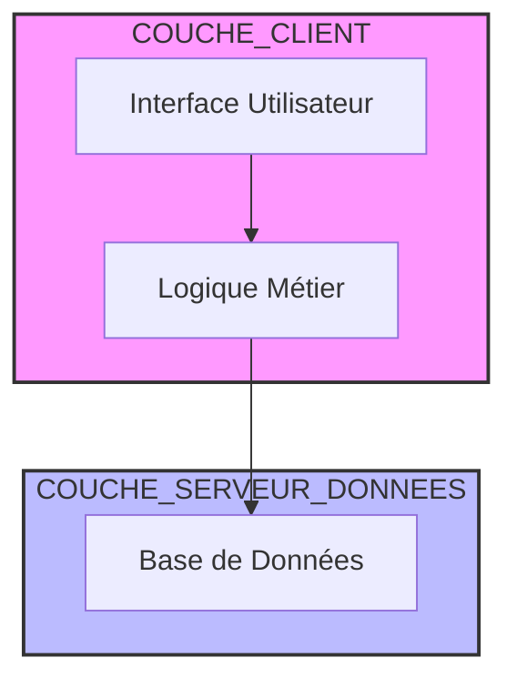
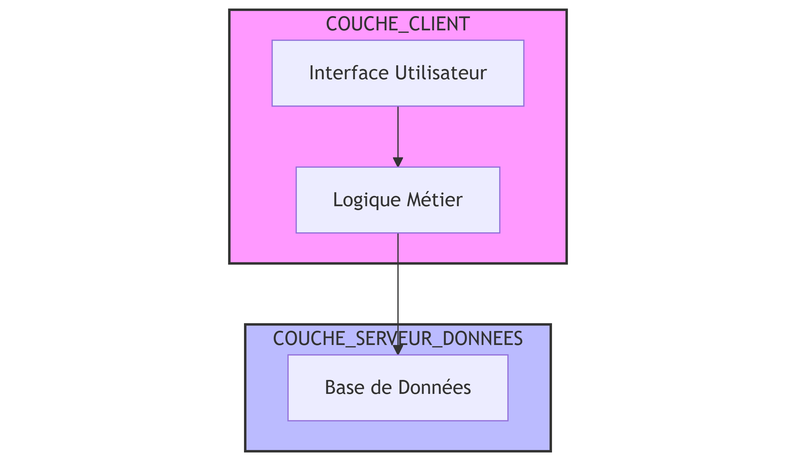
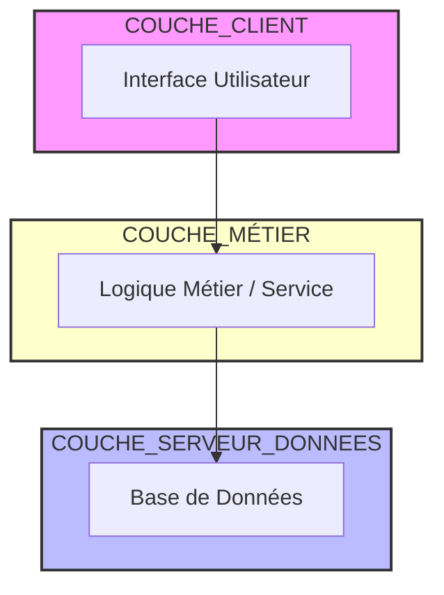
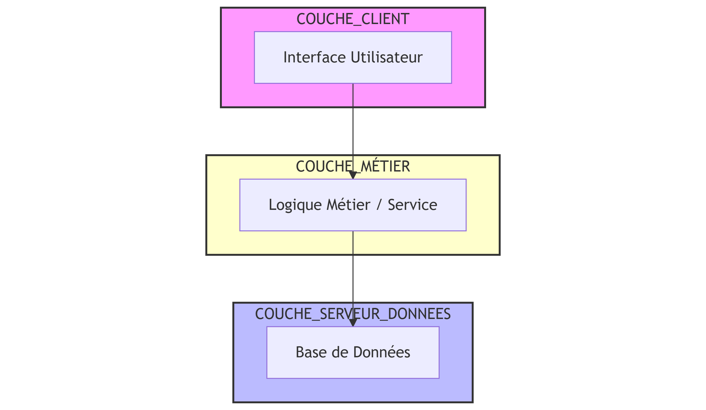

# Analyse comparative : Architecture 2-tiers vs 3-tiers

## 1. Structure et séparation des responsabilités

| Aspect | Architecture 2-tiers | Architecture 3-tiers |
|--------|-----------------------|-----------------------|
| Organisation des couches | 2 couches : **Interface + Logique métier** et **Données** | 3 couches distinctes : **Présentation**, **Logique métier**, **Accès aux données** |
| Séparation des responsabilités | Faible : l’interface gère à la fois la présentation et la validation métier | Forte : chaque couche a un rôle clair et indépendant |
| Exemple concret | La classe `InterfaceBibliotheque` gère les saisies utilisateur **et** la validation (ex. longueur de l’ISBN) | La classe `ServiceBibliotheque` gère la validation, tandis que `InterfaceConsole` se limite à afficher et saisir les données |

**→ En 3-tiers, le code est mieux organisé, plus clair et plus facile à maintenir.**

---

## 2. Couplage et réutilisabilité

| Aspect | 2-tiers | 3-tiers |
|--------|----------|----------|
| Couplage entre couches | Très fort : la logique métier dépend directement de la présentation | Faible : la couche métier peut être utilisée par plusieurs interfaces (console, web, mobile, etc.) |
| Réutilisation | Limitée, car tout est intégré dans l’interface | Élevée : on peut réutiliser `ServiceBibliotheque` sans rien changer pour d’autres clients |
| Exemple | Impossible de créer une interface web sans recopier la logique métier | Une future interface web pourrait simplement réutiliser les services existants |

**→ Le 3-tiers favorise la réutilisation et la modularité.**

---

## 3. Maintenance et évolutivité

| Aspect | 2-tiers | 3-tiers |
|--------|----------|----------|
| Maintenance | Difficile : toute modification métier impacte l’interface | Facile : les changements dans la logique métier n’affectent pas la présentation |
| Scalabilité | Limitée (tout est dans le client) | Évolutive (chaque couche peut être distribuée ou remplacée) |
| Exemple | Changer la règle de validation de l’année implique de modifier `EcranAjoutLivre` | Il suffit de modifier la méthode `AjouterLivre()` dans `ServiceBibliotheque` |

**→ Le 3-tiers est bien plus adapté à des projets qui évoluent ou grossissent.**

---

## 4. Testabilité

| Aspect | 2-tiers | 3-tiers |
|--------|----------|----------|
| Tests unitaires | Difficiles à mettre en place, car la logique est liée à l’interface | Faciles à implémenter, car la logique métier est isolée |
| Exemple | Pour tester la validation ISBN, il faut simuler des entrées utilisateur | On peut tester directement `ServiceBibliotheque.AjouterLivre()` sans interface |

**→ Le 3-tiers permet de faire des tests unitaires et automatisés sur la logique métier.**

---

## 5. Performance et complexité

| Aspect | 2-tiers | 3-tiers |
|--------|----------|----------|
| Performance brute | Meilleure (moins de couches) | Légèrement moindre (plus de transitions entre couches) |
| Complexité de développement | Simple à mettre en place | Plus complexe au départ, mais plus propre à long terme |
| Usage recommandé | Petites applications simples | Applications structurées, évolutives ou avec plusieurs interfaces |

**→ Le 2-tiers est suffisant pour un petit projet local, mais le 3-tiers devient indispensable dès qu’il faut évoluer.**

---

## 6. Exemple concret tiré du TP

| Fonctionnalité | 2-tiers | 3-tiers |
|----------------|----------|----------|
| Ajout de livre | La validation (`isbn`, `titre`, `année`) se fait dans `EcranAjoutLivre` | La validation est centralisée dans `ServiceBibliotheque.AjouterLivre()` |
| Emprunt / retour | Géré directement dans l’interface | Délégué au service métier (`EmprunterLivre`, `RetournerLivre`) |
| Requêtes SQL | Directement appelées depuis `GestionnaireBD.ts` | Isolées dans `LivreDAO` |
| Résultat | Couplage fort et difficile à tester | Architecture claire, réutilisable et testable |

---

## Conclusion

En passant de l’architecture **2-tiers** à **3-tiers**, on améliore :

- la **modularité** (chaque couche a son rôle)  
- la **réutilisabilité** du code métier  
- la **facilité de maintenance et de test**  
- la **préparation à une évolution future** (ex. interface web, API REST, etc.)

Cependant, la version **3-tiers** demande plus de **temps de développement initial** et une **meilleure compréhension de la structure logicielle**.

> ✅ En résumé :  
> - **2-tiers** → simple, rapide, mais couplé et limité.  
> - **3-tiers** → structuré, évolutif et professionnel.

---

## 💡 Pistes d’amélioration du design

### 1. Introduction d’une couche “Service d’application” ou “Contrôleur”

Actuellement, la couche de présentation (ex. `InterfaceConsole`) communique directement avec la logique métier (`ServiceBibliotheque`).  
Pour une architecture encore plus propre et proche d’un modèle **MVC** (Model–View–Controller), on pourrait ajouter une **couche intermédiaire** :

- Le **Contrôleur** (ou ApplicationService) ferait le lien entre la présentation et la logique métier.  
- Il centraliserait la gestion des erreurs, la conversion des données d’entrée, et la coordination entre plusieurs services métier.  

🟢 **Avantage :**
- Clarifie les responsabilités (présentation → contrôleur → service → DAO)  
- Simplifie la réutilisation des services pour une interface web ou mobile future  
- Facilite la gestion uniforme des retours (messages, codes d’erreurs, statuts)

---

### 2. Utilisation d’un modèle de conception (Design Pattern) pour la couche Données

Actuellement, la classe `LivreDAO` gère directement les opérations CRUD via SQLite.  
On pourrait **améliorer la flexibilité et la maintenabilité** en introduisant un **pattern Repository** ou un **pattern Factory** :

- Le **Repository Pattern** fournirait une interface abstraite (`ILivreRepository`) pour interagir avec les livres, indépendamment du type de base de données (SQLite, MongoDB, etc.).  
- Cela permettrait de **changer la base de données** sans modifier le code métier.  

🟢 **Avantage :**
- Meilleure extensibilité (changement de SGBD facile)  
- Tests unitaires facilités (possibilité de simuler un faux repository en mémoire)  
- Respect du principe **Dependency Inversion** (SOLID)

## Graphique 2-tiers

## Graphique 3-tiers

